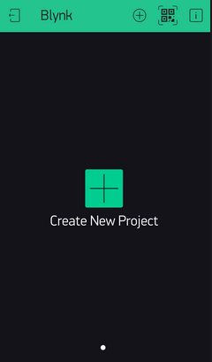
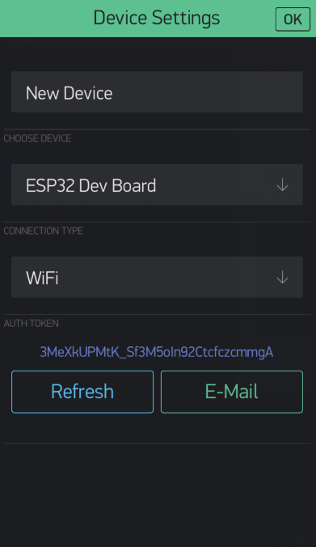
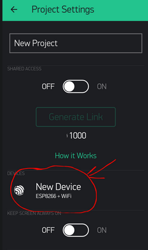
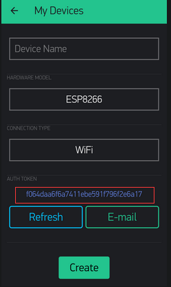
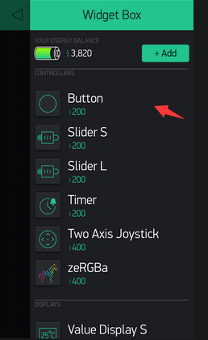
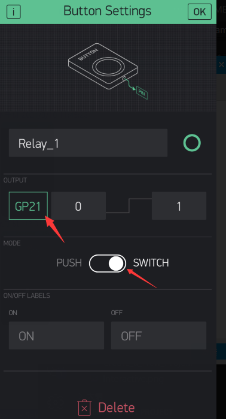
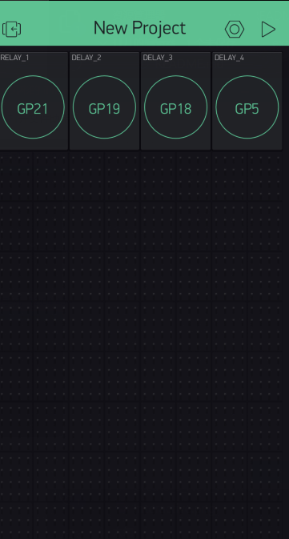

<h1 align = "center">🌟LILYGO T-RELAY🌟</h1>

## Quick start
1. Downloads APP
Blynk Apps for iOS or Android
2. Create a Blynk Account
After you download the Blynk App, you’ll need to create a New Blynk account.(If you have already created an account, you can skip this step)

  

3. Create a New Project
After you’ve successfully logged into your account, start by creating a new project.

  

4. Choose Your Hardware
Select the hardware model you will use. 

  

5. Auth Token

  
  

6. Add a Widget

  
Configure GP21, GP19, GP18, and GP5 in sequence.

  

  

7. Upload routines (note the configuration of wifi and Auth tokens).Now you can use it to control the state of the relay.

## Blynk References
[Getting Started Guide](https://www.blynk.cc/getting-started)
[Documentation](http://docs.blynk.cc/)
[Sketch generator](https://examples.blynk.cc/)
